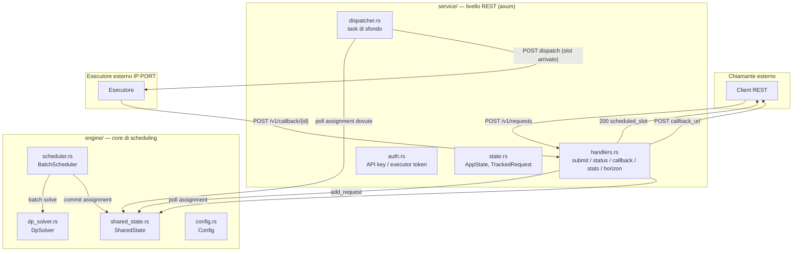

# CarbonShift RS — architettura e guida al codice

Questo documento descrive l'architettura del crate `carbonshift_rs`, lo scopo
di ciascun file sorgente e come eseguire i test (con e senza esecuzione reale
delle richieste su un servizio esterno). Per lo stato di avanzamento del
servizio REST e le decisioni prese, vedi [PLAN_SERVICE.md](PLAN_SERVICE.md).

## Panoramica architetturale

Il crate è organizzato in tre livelli, con una separazione netta fra *core di
scheduling*, *interazione REST/HTTP* e *strumenti di simulazione/test*:



**Flusso**: il chiamante invia una richiesta REST; l'`handler` la inserisce
nella coda dell'`engine` e attende (con timeout) che il `BatchScheduler`
produca un'assegnazione (slot + flavour); risponde subito al chiamante con lo
slot previsto. Quando l'orologio reale raggiunge quello slot, il
`dispatcher` (task in background) invia il job all'esecutore esterno
configurato (`EXECUTOR_URL`), passandogli un URL di callback verso questo
stesso servizio. L'esecutore, terminato il lavoro, richiama quell'URL con il
risultato; il servizio lo inoltra al `callback_url` originale del chiamante.

`engine/` non sa nulla di HTTP: riceve `Request` e produce `Assignment`
tramite `SharedState`, esattamente come faceva prima dell'introduzione del
servizio REST (i benchmark in `sim/`/`bin/nshift` lo usano allo stesso modo).

## Struttura dei file

### `src/engine/` — core di scheduling (nessuna I/O oltre al log CSV)

| File | Scopo |
|---|---|
| `config.rs` | Struct `Config`: tutti i parametri dell'algoritmo (batch size, error budget, capacity tiers, pruning DP, strategie online, ecc.) e i relativi default. |
| `types.rs` | Tipi di dominio condivisi: `Request`, `Assignment`, `RequestAssignment`, `Flavour`, `CapacityTier`. |
| `shared_state.rs` | `SharedState`: stato mutabile condiviso (coda pending, assegnazioni committate, statistiche, rollback) protetto da un unico `Mutex`; `SolverSnapshot` per letture coerenti dal solver. |
| `dp_solver.rs` | `DpSolver`: programmazione dinamica per l'assegnazione ottima (slot, flavour) di un batch, con pruning (beam/kbest), vincolo di errore a finestra scorrevole, fallback greedy. |
| `scheduler.rs` | `BatchScheduler`: il *main loop* che polla la coda pending, decide quando lanciare un batch (piena/timeout/flush), dispatcha worker thread che chiamano il DP solver (o le strategie online), gestisce il rollback su breach di capacity-tier e l'orologio virtuale/reale degli slot. |
| `metrics_logger.rs` | `MetricsLogger`: scrittura CSV thread-safe delle run del solver e delle assegnazioni (usata dai benchmark; disattivabile). |
| `online_swarm.rs` / `online_swarmerge.rs` | Strategie di scheduling online alternative alla DP (bandit ε-greedy, ant colony) con due modelli di concorrenza (serializzato vs. merge lock-free). |

### `src/sim/` — solo simulazione/benchmark, mai usato dal servizio REST

| File | Scopo |
|---|---|
| `generator.rs` | `RequestGenerator`: genera richieste sintetiche (arrivi gaussiani) o ne rigioca da uno scenario precomputato — sostituisce l'ingresso HTTP nelle simulazioni offline. |
| `scenario.rs` | Caricamento/serializzazione di scenari di test (JSON): metadati, richieste precomputate, forecast di carbon intensity. |

### `src/service/` — livello REST/HTTP (il servizio dockerizzabile)

| File | Scopo |
|---|---|
| `models.rs` | DTO serde per richieste/risposte HTTP: `SubmitRequestPayload`, `RequestStatusResponse`, `ExecutorDispatchPayload`, `ExecutorCallbackPayload`, `CallerCallbackPayload`, `StatsResponse`, `HorizonResponse`. |
| `state.rs` | `AppState` (handle condiviso fra handler e dispatcher: `SharedState` dell'engine + tracking HTTP) e `ServiceConfig` (parametri specifici del servizio: URL esecutore, timeout, retry, auth, soglia di orizzonte). `TrackedRequest` tiene lo stato HTTP (callback URL, payload, stato, tentativi) che l'engine non conosce. |
| `handlers.rs` | Handler axum: `submit_request` (POST /v1/requests), `get_request_status` (GET /v1/requests/{id}), `executor_callback` (POST /v1/callback/{id}), `stats`, `horizon`, `ready`, `health`; validazione input e guardia SSRF sui `callback_url`. |
| `auth.rs` | Middleware di autenticazione: `X-API-Key` per i chiamanti, `X-Executor-Token` per l'esecutore, confronto a tempo costante. |
| `dispatcher.rs` | Task di sfondo (`tokio`) che invia i job all'esecutore quando lo slot arriva, con retry a backoff esponenziale e limite massimo tentativi; logga l'avvicinarsi all'esaurimento dell'orizzonte. |
| `server.rs` | Costruzione del router axum e collegamento dei middleware alle rotte. |

### `src/bin/` — binari

| Binario | Sorgente | Scopo |
|---|---|---|
| `carbonshift-service` | `bin/service/main.rs` | Il servizio REST dockerizzabile: legge la configurazione da env var, avvia `BatchScheduler` (senza `RequestGenerator`: le richieste arrivano via HTTP), il dispatcher e il server axum. |
| `simulate` | `bin/simulate/main.rs` | Simulatore standalone (ex `src/main.rs`): genera/rigioca richieste e fa girare motore + generatore per una run offline, senza HTTP. |
| `nshift` | `bin/nshift/main.rs` (+ `swarm.rs`) | Benchmark multi-N: esegue lo scheduler su uno scenario per diverse dimensioni di batch, produce output compatibile con i notebook Python esistenti (`tests/battery/*.ipynb`). |

`bin/nshift.rs` e `bin/run_nshift_speed.rs` sono stub legacy vuoti, esclusi
dalla build (`autobins = false` in `Cargo.toml`, nessun `[[bin]]` li punta).

### Altri file

| File | Scopo |
|---|---|
| `lib.rs` | Dichiara `engine`/`sim`/`service` e ri-esporta i moduli di `engine`/`sim` alla radice del crate (`crate::config`, `crate::types`, ...) per compatibilità con il codice esistente. |
| `Cargo.toml` | Dipendenze e target binari espliciti. |
| `tests/integration_scenario.rs` | Test di integrazione offline: rigioca uno scenario completo e verifica che tutte le richieste siano schedulate senza violazioni di arrival/deadline. |
| `tests/service_api.rs` | Test di integrazione del livello `service`: contratto HTTP (auth, validazione, 404), stats/horizon/ready, e un test end-to-end con lo scheduler realmente avviato. |
| `Dockerfile` | Build multi-stage del binario `carbonshift-service`. |
| `docker-compose.yml` | Stack di test: il servizio + un esecutore di esempio (`docker/mock_executor.py`). |
| `docker/mock_executor.py` | Stub minimale (solo stdlib Python) che simula l'esecutore esterno per i test end-to-end via Docker. |

## Come eseguire i test

### 1. Unit test del core (`engine`, `sim`)

Nessuna rete, nessun processo esterno — logica pura.

```sh
cd rust
cargo test --lib
```

Copre: DP solver (pruning, repricing dei capacity tier, fallback greedy),
`SharedState` (rollback, finestra d'errore), scheduler (DP vs. greedy
singleton, lock/unlock delle assegnazioni future), strategie swarm, guardie
SSRF/auth/backoff del servizio (funzioni pure, senza rete).

### 2. Test di integrazione dell'engine (replay di uno scenario offline)

```sh
cargo test --test integration_scenario
```

Nota: questo test richiede un file scenario che non è presente in questo
workspace (`../online2/tests/Nshift_speed/scenario_seed_2030.json`) — fallisce
per un motivo preesistente, indipendente dal servizio REST.

### 3. Test HTTP del layer `service` — **senza** esecuzione reale su un server esterno

`tests/service_api.rs` usa `tower::ServiceExt::oneshot` per invocare il router
axum **in-process**, senza aprire alcun socket di rete e senza `EXECUTOR_URL`
configurata (dry-run implicito): verifica auth, validazione, SSRF guard,
stats/horizon/ready, e un caso end-to-end in cui lo scheduler reale viene
avviato in-process per produrre un'assegnazione vera.

```sh
cargo test --test service_api
```

### 4. Test manuale end-to-end **senza** esecutore reale (dry-run)

Avvia il binario senza impostare `EXECUTOR_URL`: il dispatcher logga cosa
avrebbe inviato invece di fare la richiesta HTTP.

```sh
cargo build --release --bin carbonshift-service
LISTEN_ADDR=127.0.0.1:8080 SELF_BASE_URL=http://127.0.0.1:8080 \
  TOTAL_SLOTS=200 RUST_LOG=info \
  ./target/release/carbonshift-service
```

```sh
curl -X POST http://127.0.0.1:8080/v1/requests \
  -H 'Content-Type: application/json' \
  -d '{"deadline_seconds": 15, "payload": {"job": "demo"}}'

curl http://127.0.0.1:8080/v1/requests/1
curl http://127.0.0.1:8080/v1/stats
curl http://127.0.0.1:8080/v1/horizon
curl http://127.0.0.1:8080/ready
```

Per simulare manualmente anche il callback dell'esecutore (senza un vero
esecutore in ascolto):

```sh
curl -X POST http://127.0.0.1:8080/v1/callback/1 \
  -H 'Content-Type: application/json' \
  -d '{"success": true, "result": {"answer": 42}}'
```

### 5. Test end-to-end **con** un esecutore reale, via Docker Compose

`docker-compose.yml` fa girare il servizio insieme a un esecutore di esempio
(`docker/mock_executor.py`, stdlib Python: accetta il dispatch, "esegue" con
un breve sleep, richiama il callback con un risultato finto).

```sh
cd rust
docker compose up --build
```

In un altro terminale:

```sh
curl -X POST http://127.0.0.1:8080/v1/requests \
  -H 'Content-Type: application/json' \
  -d '{"deadline_seconds": 10, "payload": {"job": "demo"}}'

# attendere che lo slot assegnato arrivi, poi:
curl http://127.0.0.1:8080/v1/requests/1
# -> "status":"completed" una volta che mock-executor ha richiamato /v1/callback
```

```sh
docker compose down
```

Per puntare il servizio a un **esecutore reale** invece del mock, basta
impostare `EXECUTOR_URL=http://<IP>:<PORTA>/<path>` nell'ambiente del
container `carbonshift-service` (o direttamente `EXECUTOR_URL=...` se lo si
esegue con `cargo run --bin carbonshift-service` fuori da Docker) — il resto
della pipeline (submit, scheduling, dispatch, callback, inoltro al
chiamante) è identico.

## Riferimento variabili d'ambiente del servizio

Documentate anche come doc-comment in `src/bin/service/main.rs`. Riassunto:

| Variabile | Default | Scopo |
|---|---|---|
| `LISTEN_ADDR` | `0.0.0.0:8080` | Indirizzo di bind HTTP. |
| `SELF_BASE_URL` | `http://LISTEN_ADDR` | URL con cui il servizio si presenta all'esecutore per il callback. |
| `EXECUTOR_URL` | *(assente)* | URL base dell'esecutore esterno. Assente = dry-run. |
| `SUBMIT_WAIT_TIMEOUT_SECS` | `5` | Quanto attende `POST /v1/requests` prima di rispondere `202 pending`. |
| `TOTAL_SLOTS` | `8640` (24h @ 10s/slot) | Orizzonte di pianificazione finito (vedi limitazioni in PLAN_SERVICE.md). |
| `CARBONSHIFT_API_KEY` | *(assente)* | Se impostata, richiede `X-API-Key` su `/v1/requests*`. |
| `CARBONSHIFT_EXECUTOR_TOKEN` | *(assente)* | Se impostata, richiede `X-Executor-Token` su `/v1/callback/{id}`. |
| `CARBONSHIFT_ALLOW_PRIVATE_CALLBACKS` | `0` | Consente `callback_url` verso IP loopback/privati (solo test locali). |
| `EXECUTOR_MAX_RETRIES` | `5` | Tentativi di dispatch prima di marcare `Failed`. |
| `EXECUTOR_RETRY_BASE_MS` / `EXECUTOR_RETRY_MAX_MS` | `500` / `30000` | Backoff esponenziale fra i tentativi. |
| `HORIZON_READY_THRESHOLD` | `0.9` | Frazione di `TOTAL_SLOTS` oltre la quale `GET /ready` risponde `503`. |
| `CARBONSHIFT_ENABLE_SOLVER_LOGGING` | `0` | Abilita i CSV di log del solver (utili per debug, non per produzione). |
